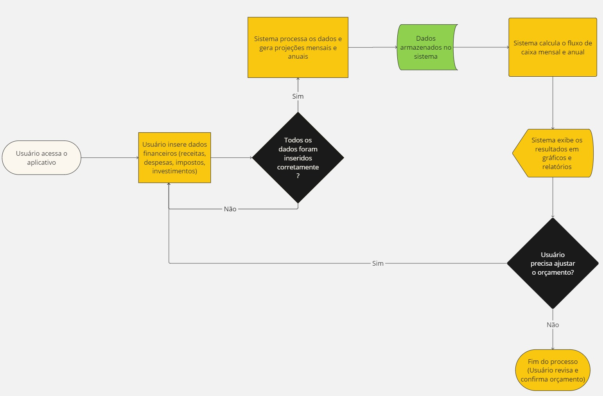

# Budget Flow - Projeção Mensal e Anual

Este projeto é uma aplicação web interativa criada com **Streamlit** que permite aos usuários inserir receitas, despesas, impostos e investimentos mensais, e ver automaticamente uma projeção mensal e anual de seu fluxo de caixa. 

## Funcionalidades

- Inserção de dados de receitas, despesas fixas, despesas variáveis, impostos e investimentos.
- Cálculo automático do fluxo de caixa mensal e anual.
- Visualização gráfica das despesas mensais e anuais.

##  Deploy na Streamlit Cloud
Este projeto está hospedado gratuitamente no Streamlit Cloud. Você pode acessar a versão online diretamente no seguinte link:

Acessar Aplicativo Budget Flow 

https://budgetflow.streamlit.app/

## Tecnologias Utilizadas

- **Python**: Linguagem de programação principal.
- **Streamlit**: Framework para criação de aplicativos web interativos.
- **Pandas**: Para manipulação de dados.
- **Matplotlib**: Para geração de gráficos.

## Fluxograma

## Futuras Atualizações

Aqui estão algumas melhorias e funcionalidades que planejo implementar nas próximas versões:

1. **Exportação de Dados**: Opção para exportar os resultados do orçamento (mensal e anual) em formato CSV ou Excel.
2. **Suporte para Multimoedas**: Adicionar a funcionalidade para trabalhar com múltiplas moedas e taxas de câmbio.
3. **Dashboard Customizável**: Permitir que o usuário personalize quais gráficos e informações são exibidos no painel principal.
4. **Alertas e Recomendações**: Implementar alertas quando o orçamento mensal estiver fora do planejado e sugerir ajustes para melhor controle financeiro.
5. **Integração com APIs de Investimentos**: Conectar com APIs externas para obter dados de investimentos em tempo real (ações, CDB, poupança, etc.).
6. **Relatórios Automáticos**: Geração de relatórios automáticos mensais e anuais com análise detalhada de despesas e receitas.
